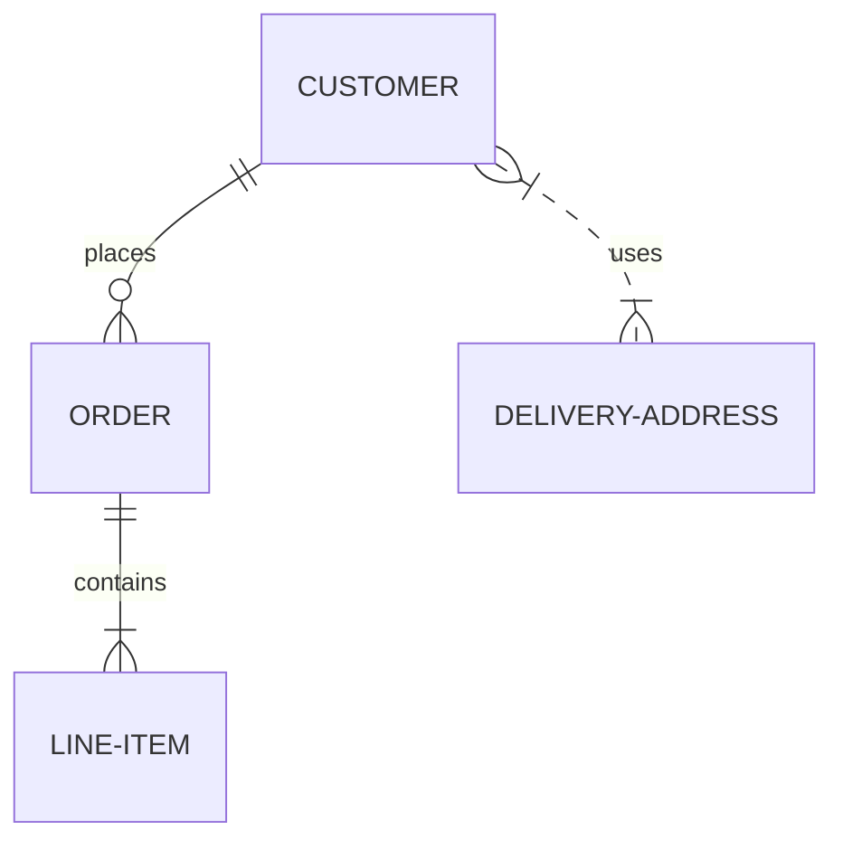

# Slidev Theme Nord

Refer to [Nord](https://www.nordtheme.com/)

---

# Code

Use code snippets and get the highlighting directly!

```ts
interface User {
  id: number
  firstName: string
  lastName: string
  role: string
}

function updateUser(id: number, update: Partial<User>) {
  const user = getUser(id)
  const newUser = { ...user, ...update }
  saveUser(id, newUser)
}
```

---
layout: section
---

# Layouts

---
layout: mermaid-left
---

# Mermaid



::right::

- This is block diagrams

```md
<!-- Usage -->
---
layout: mermaid-left
---

<!-- Mermaid code block -->

::right::

- This is block diagrams
```

---
layout: section
---

# Components


---

# Subtitles
Subtitles can be displayed as components

```md
<!-- Usage -->
<Subtitles
  content="これは日本語の字幕です。折りたたみはしません。二行分のスペースを設けています。"
  >
</Subtitles>
```

<Subtitles
  content="これは日本語の字幕です。折りたたみはしません。二行分のスペースを設けています。"
  >
</Subtitles>
